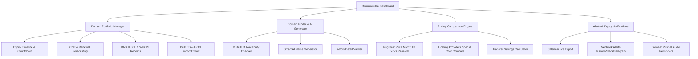

# DomainPulse: Comprehensive Domain Finder, Portfolio Manager & Hosting Comparison Platform

## Overview
**DomainPulse** is an all-in-one web application designed for entrepreneurs, domain investors, agency owners, and developers. It helps users track and manage multiple domain portfolios, monitor expiration dates with proactive renewal countdowns and alerts, find available domains with an AI-driven name generator, and compare real-time pricing across top domain registrars and web hosting providers.

---

## Key Features & Architecture



### 1. 📊 Domain Portfolio & Expiry Management
- **Dashboard Overview**: Metrics for Total Domains, Expiring in < 7 Days (Critical), Expiring in < 30 Days (Warning), Safe Domains, Total Annual Renewal Cost, and Average Domain Price.
- **Visual Expiry Timeline**: Interactive calendar & urgency-colored countdown badges (Critical Red, Warning Amber, Healthy Emerald).
- **Portfolio Table & Grid View**: Filter by registrar (GoDaddy, Namecheap, Cloudflare, Hostinger, Porkbun, etc.), TLD, tags/client projects, and status.
- **Domain Detail Modal**: Manage registrar details, purchase price, renewal cost, auto-renewal toggles, SSL status, nameservers, custom DNS records (A, CNAME, MX, TXT), and notes.
- **Import/Export**: One-click import from CSV/JSON and instant backup export.
- **Renewal Savings Estimator**: Highlights overpaid domains on expensive registrars with instant transfer cost-saving recommendations.

### 2. 🔍 Domain Finder & AI Availability Checker
- **Multi-TLD Bulk Checker**: Search any keyword or brand name to test availability across top extensions (`.com`, `.in`, `.ai`, `.io`, `.org`, `.net`, `.co`, `.tech`, `.app`, `.dev`, `.xyz`, etc.).
- **Live RDAP / DNS Availability Engine**: Instant check with real WHOIS/RDAP query resolution and smart status badges (Available vs Registered).
- **AI Domain Name Generator**: Enter business niches (e.g. "Fintech AI", "Eco Fashion", "Cybersecurity Agency") with tone selector (Brandable, Short & Punchy, Compound/Modern, Tech-focused) to generate creative names with instant availability checks.
- **Detailed WHOIS Inspector**: Creation date, expiry date, registrar name, and raw RDAP info for taken domains.

### 3. 💰 Registrar & Web Hosting Pricing Comparison Matrix
- **Domain Registrars Comparison**:
  - Compares **1st Year Registration Price**, **Annual Renewal Price** (uncovering hidden renewal spikes), **Transfer Price**, **Free WHOIS Privacy**, and **Free SSL**.
  - Registrars: Cloudflare, Porkbun, Namecheap, GoDaddy, Hostinger, Dynadot, AWS Route 53, Squarespace.
  - TLD filter: Compare rates specific to `.com`, `.in`, `.ai`, `.io`, `.org`, etc.
  - **Transfer Savings Calculator**: Input current domains to calculate annual savings if transferred to lowest-cost registrars (e.g. Cloudflare / Porkbun).
- **Web Hosting Comparison Engine**:
  - Compare Hosting Types: Shared, WordPress, VPS, Cloud / Serverless.
  - Providers: Hostinger, Bluehost, SiteGround, DigitalOcean, Cloudways, Vultr, AWS Lightsail, Vercel.
  - Compare Specs: NVMe Storage, Bandwidth, Free Domain Included, SSL, Server Locations (India, US, Europe, Singapore), Monthly vs Yearly Pricing, Refund Policy.
  - Direct deal buttons & coupon codes.

### 4. 🔔 Alerts, Reminders & Productivity Tools
- **Calendar Reminders**: Export all domain renewal deadlines to `.ics` file (Google Calendar, Apple Calendar, Outlook).
- **Custom Webhook Integration**: Configure Slack, Discord, or Telegram webhooks for automated renewal alert simulation.
- **Browser Notifications & In-App Notification Center**: Unread alert counter and urgent expiry sound chime.
- **Multi-Currency Support**: Switch seamlessly between **INR (₹)**, **USD ($)**, **EUR (€)**, and **GBP (£)** with auto-conversion.

---

## User Review Required

> [!IMPORTANT]
> - The application will be created as a modern, high-performance, single-page application using HTML5, modern vanilla CSS3 design system with glassmorphic dark/light styling, and modular JavaScript (ES Modules).
> - All portfolio data will be automatically persisted in `localStorage`, pre-loaded with realistic sample domains (e.g. across GoDaddy, Namecheap, Cloudflare, Hostinger) so the app is instantly functional and impressive on first launch.
> - Would you like any additional specific domain registrars or Indian TLDs (like `.co.in`, `.net.in`, `.org.in`) emphasized? We will include `.in`, `.co.in` alongside global TLDs by default.

---

## Proposed Changes

### Tech Stack & File Structure
```
c:\WorknAi Project\Domain Manager\
├── index.html                  # Main Application Shell & UI Layout
├── css/
│   ├── style.css               # Core CSS variables, typography, glassmorphism & themes
│   ├── components.css          # Cards, tables, modals, badges, sliders, stat widgets
│   └── responsive.css          # Tablet & mobile responsive enhancements
└── js/
    ├── app.js                  # Main controller & navigation router
    ├── state.js                # State management, local storage & currency engine
    ├── portfolio.js            # Domain portfolio CRUD, filters, timeline & cost analytics
    ├── domainFinder.js         # Multi-TLD checker, AI name generator & WHOIS parser
    ├── pricingCompare.js       # Registrar & hosting price matrix, filter & savings calc
    ├── notifications.js        # Expiry alerts, calendar .ics generator & webhooks
    └── initialData.js          # Realistic preloaded domains, registrars & hosting data
```

#### [NEW] [index.html](file:///c:/WorknAi%20Project/Domain%20Manager/index.html)
- Semantic HTML structure with header, navigation bar with active badges, search header, currency picker, tab views (Dashboard, Portfolio Manager, Domain Finder & AI, Pricing Comparison, Alert Center), and quick-add modal.

#### [NEW] [css/style.css](file:///c:/WorknAi%20Project/Domain%20Manager/css/style.css)
- Premium dark/light theme color tokens, glowing accents, glassmorphic cards, smooth transitions, modern typography, custom scrollbars, and keyframe animations.

#### [NEW] [css/components.css](file:///c:/WorknAi%20Project/Domain%20Manager/css/components.css)
- Urgency badges (`Critical: < 7 Days`, `Warning: < 30 Days`, `Safe: > 30 Days`), pricing matrix tables, comparison cards, visual progress bars, interactive timeline track, and search filter pills.

#### [NEW] [js/initialData.js](file:///c:/WorknAi%20Project/Domain%20Manager/js/initialData.js)
- Comprehensive datasets:
  - Popular domain registrars with 1st year, renewal, transfer prices for 20+ TLDs.
  - Comprehensive hosting plans with specs and pricing.
  - Realistic initial domain portfolio with upcoming expirations to demonstrate all alerts and analytics.

#### [NEW] [js/portfolio.js](file:///c:/WorknAi%20Project/Domain%20Manager/js/portfolio.js)
- Domain management, expiration calculation, auto-renewal toggles, search/filter/sort, CSV bulk export/import, DNS record editor, and financial spending projections.

#### [NEW] [js/domainFinder.js](file:///c:/WorknAi%20Project/Domain%20Manager/js/domainFinder.js)
- Search across top TLDs, RDAP/WHOIS lookup integration, AI brand name generation algorithms (prefix/suffix blending, portmanteaus, phonetic combos, modern SaaS names), and instant price estimation.

#### [NEW] [js/pricingCompare.js](file:///c:/WorknAi%20Project/Domain%20Manager/js/pricingCompare.js)
- Registrar comparison matrix (highlighting renewal price spikes vs honest flat renewals), hosting comparison by category (Shared, VPS, Cloud), and interactive Domain Transfer Savings Calculator.

#### [NEW] [js/notifications.js](file:///c:/WorknAi%20Project/Domain%20Manager/js/notifications.js)
- Expiry detector, sound alert, `.ics` calendar generator for 1-click import into Google/Apple/Outlook calendars, and webhook dispatch simulation.

---

## Verification Plan

### Automated / Browser Verification
1. **Launch Local Server**: Start local HTTP server on port 3000/5173.
2. **Interactive Subagent Browser Testing**:
   - Verify Portfolio Dashboard: stat cards, urgency filters (expiring < 7 days, < 30 days), sorting.
   - Verify Adding a Domain & Editing DNS / Renewal dates.
   - Verify Expiry Alerts & Calendar `.ics` generation.
   - Verify Domain Finder: search keywords, test TLD availability, test AI name generator.
   - Verify Pricing Comparison: toggle TLDs, compare renewal costs, test Transfer Savings Calculator.
   - Verify Currency Switcher (INR / USD / EUR / GBP).
   - Test CSV export & import.
3. Take high-resolution screenshots & recording of the UI.
